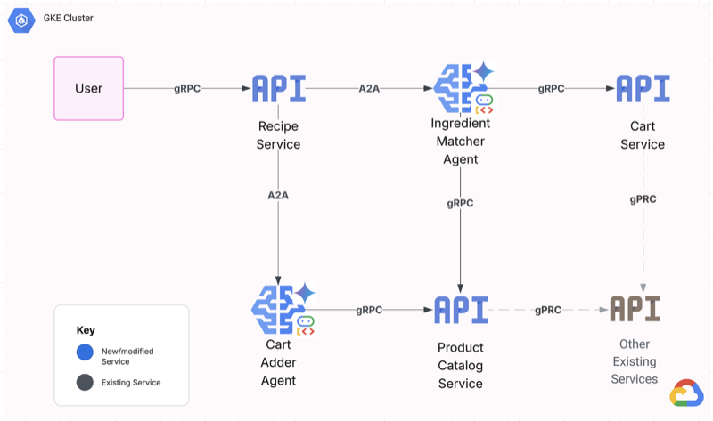
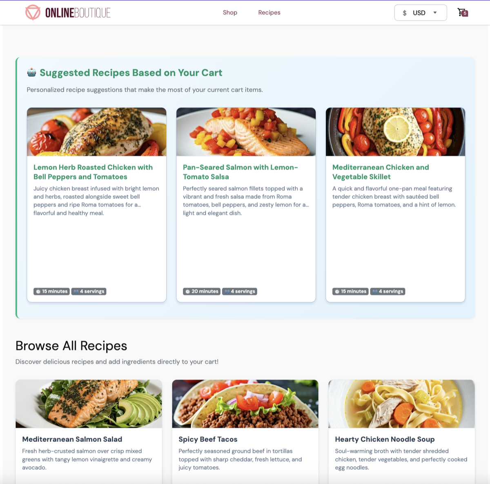
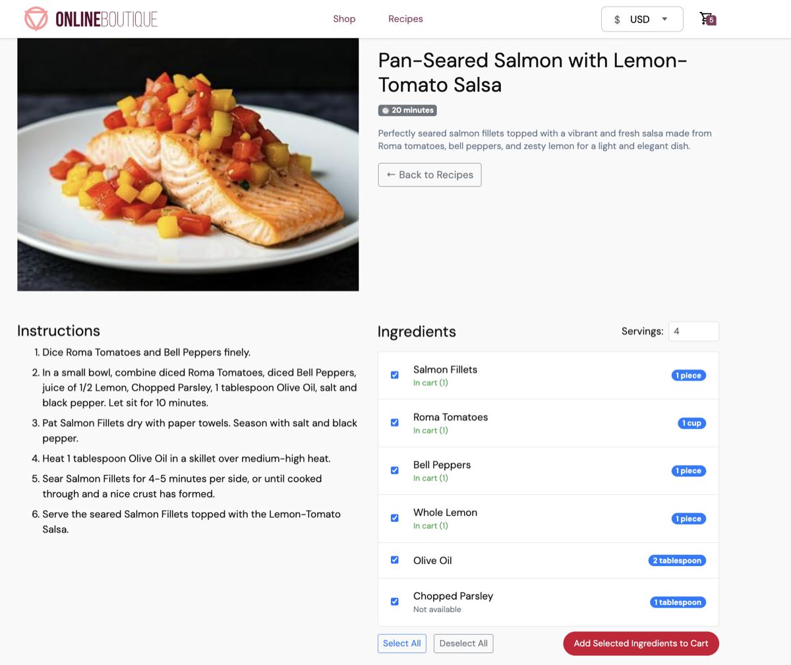

# Cart-to-Kitchen AI Assistant

A microservices-based e-commerce application enhanced with AI-powered recipe generation and smart cart management. Users can browse products, get AI-generated recipes based on their cart contents, and seamlessly add recipe ingredients to their cart.

The project is an extension to the online boutique microservices demo. See online-boutique-README.md for original README containing details.

## Project Overview

The Cart-To-Kitchen AI Assistant generates dynamic AI recipes based on cart items and suggests additional items to add to cart. This is powered by Google's Gemini and Imagen through the Agent Development Kit (ADK) and Agent to Agent (A2A) protocol. This feature generates personalized recipe suggestions based on users' current cart contents while maintaining full compatibility with the existing A2A architecture.

### Core AI Services

#### RecipeService (Orchestrator)

- **Generates recipe requests** ie. Create recipe for chicken stirfry
- **Extracts ingredients** from natural language recipe descriptions
- **Orchestrates A2A agents** process the recipe step-by-step
- **Returns success confirmation** with matched products and ingredients
- **Generates AI-powered suggested recipes** based on user's current cart contents

#### IngredientMatcherAgent (A2A Agent)

- **Receives ingredient lists** from RecipeService via A2A protocol
- **Matches ingredients to product catalog** using the productcatalogservice
- **Returns product IDs** for ingredients found in the store catalog
- **Handles ingredient variations** (e.g., "chicken breast" → "chicken" product)

#### CartAdderAgent (A2A Agent)

- **Receives product lists** from RecipeService via A2A protocol
- **Adds items to shopping cart** using real gRPC calls to cartservice
- **Manages cart operations** for recipe-based shopping with actual cart persistence
- **Confirms successful additions** back to RecipeService with cart contents summary

### Technology Stack

- **AI/ML**: Google Gemini 2.5 Flash Lite, Google Imagen 3.0 Fast
- **Agent Framework**: ADK (Agent Development Kit) with A2A protocol
- **Backend**: gRPC microservices, Python, Go, C#, Node.js, Java
- **Frontend**: Go templates, Server-Sent Events, progressive loading
- **Infrastructure**: Kubernetes, Redis, Protocol Buffers

### Architecture



## Key Capabilities

1. **Cart-to-Recipe Flow**: Generates personalized recipes based on current cart contents
2. **Progressive Image Loading**: Recipe images generated with Google Imagen 3.0 Fast with background processing
3. **Agent-to-Agent Communication**: Smart agents coordinate ingredient matching and cart updates
4. **Real-time UI**: Live updates via SSE without page refreshes
5. **Optimized Images**: Automatic compression and caching for fast delivery

## Screenshots

| Recipes Page with AI suggested recipes             | Detailed Recipe with Ingredients to add to cart |
| -------------------------------------------------- | ----------------------------------------------- |
|  |    |

---

# Local Development with Minikube and Skaffold

## Quick Start for Local Development

### 1. Start Minikube

```bash
# Start minikube with adequate resources
minikube start


# Verify minikube is running
minikube status
```

### 2. Configure Docker to use Minikube's Docker daemon

```bash
# Point your Docker CLI to minikube's Docker daemon
eval $(minikube docker-env)


# See all kubectl contexts
kubectl config get-contexts


# Switch to minikube context
kubectl config use-context minikube


# Check context: should show minikube
kubectl config current-context


# Configure Docker for minikube
eval $(minikube docker-env)


# Deploy locally
skaffold run -p local
```

### 4. Access the Application

```bash
# Get the minikube service URL
minikube service frontend-external -n boutique --url


# use minikube tunnel or use port forwarding
minikube tunnel


kubectl port-forward svc/frontend-external 8080:80 -n boutique
# Then access: http://localhost:8080
```

### For Production (GKE)

## Terraform to create artifact registry for custom images, and deploy GKE cluster

#### 1. Update gcp project_id in terraform.tfvars

gcp_project_id = "your-gcp-project-id-here"

#### 2. Log into gcloud CLI and enable gcp cloud resourcemanager API for terraform usage

```
gcloud auth login

gcloud services enable cloudresourcemanager.googleapis.com --project=gke-a2a
```

#### 3. Export google credentials and run terraform

```
cd terraform
terraform init
terraform apply
```

#### 4. After Terraform finishes, you need to configure your local kubectl to talk to the new cluster.

```
gcloud container clusters get-credentials $(terraform output -raw gke_cluster_name) --location $(terraform output -raw gke_cluster_location) --project $(terraform output -raw gcp_project_id)

# This command updates your local ~/.kube/config file. You can verify the connection with kubectl get nodes.
```

#### 5. Configure Docker to authenticate with Artifact Registry (one-time setup)

`gcloud auth configure-docker $(terraform output -raw gke_cluster_location)-docker.pkg.dev
`

#### 6. From the terraform directory, get artifact repo url

```
REPO_URL=$(cd terraform && terraform output -raw artifact_registry_repository_url)
echo $REPO_URL

# should look like us-west1-docker.pkg.dev/your-project-id/online-boutique-images
```

#### Update secret location for k8 secret (handled by skaffold). We are using service account keys.

```
# update location in skaffold.yaml
setFiles:
   googleCloud.serviceAccountKey: ~/gcp/key.json
```

#### From the root directroy, run Skaffold for production to build images, push to artifact registry, create boutique namespace, and deploy app to GKE. First ensure docker engine is installed

```
skaffold run -p production --default-repo=$REPO_URL
```

# Access the app

Note: The endpoint shown in the GKE console for the online-boutique cluster is the Cluster endpoint (k8 api server/control plane for kubectl). The app endpoint will be the External IP of the frontend-external Service

`kubectl get service frontend-external -n boutique`

To update a service if there is code change, run the same skaffold command again and skaffold will detect the code change and only rebuild the appropriate image and push to artifact registry and deploy to GKE.

`skaffold run -p production --default-repo=$REPO_URL`
